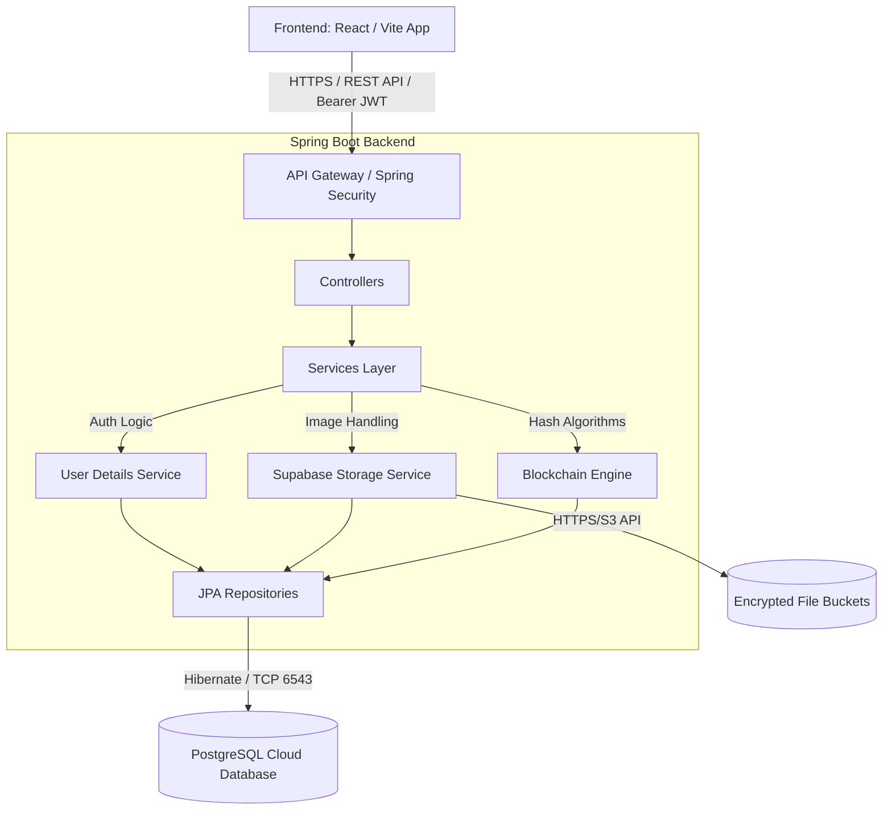
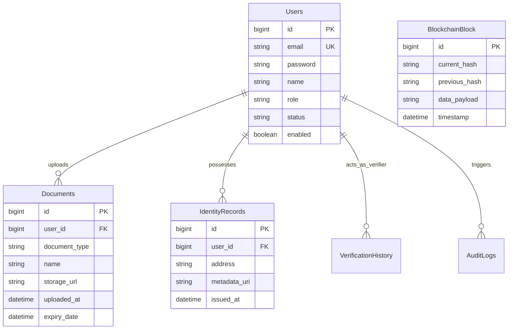

<div align="center">
  
  
  
  
  
  <br />
  <br />

  # 🛡️ Identity Vault Enterprise
  **Next-Generation Blockchain Identity & Automated KYC Verification Platform**

  <p align="center">
    Identity Vault is a production-grade, cryptographically secure digital identity management platform designed for enterprise organizations. It unifies user onboarding, automated document verification, Role-Based Access Control (RBAC), and blockchain-ledger auditing into a single seamless portal.
  </p>
</div>

---

## 📑 Table of Contents
1. [Core Capabilities](#-core-capabilities)
2. [System Architecture](#-system-architecture)
3. [Technology Stack](#-technology-stack)
4. [Enterprise Security & RBAC](#-enterprise-security--rbac)
5. [Database Schema](#-database-schema)
6. [API Architecture & Endpoints](#-api-architecture--endpoints)
7. [Local Development Setup](#-local-development-setup)
8. [Configuration & Environment](#-configuration--environment)
9. [Deployment Strategy](#-deployment-strategy)
10. [CI/CD Pipeline](#-cicd-pipeline)
11. [License](#-license)

---

## 🚀 Core Capabilities

### 1. Cryptographic Identity Management
- **W3C Decentralized Identifiers (DID):** Utilizes cryptographic identity generation based on the W3C DID Core specification, ensuring universally unique and computationally verifiable digital personas.
- **Immutable Audit Trails:** All verification events, approvals, and data mutations are strictly hashed and appended to a digital ledger, making historical alteration mathematically impossible without breaking subsequent block hashes.

### 2. Multi-Persona Dashboard Experience
Depending on the JWT claims presented upon authentication, the UI dynamically re-renders to strictly route the user:
- **Consumer Portal (`USER`):** Upload standard government ID documents, instantly track verification progress, and securely output custom JSON Web Token (JWT) proofs to third-party institutions.
- **Verification Portal (`VERIFIER`):** Live queue monitoring, specialized UI to ingest OCR/Blockchain validation algorithms, and one-click manual overrides for flagged items with permanent audit receipt generation.
- **Governance Portal (`ADMIN`):** Macro-level insights, KPI aggregation, real-time threat neutralization capabilities, and global account suspension switches.

### 3. Automated KYC Document Processing
- **Blob Storage:** Direct connection to Supabase S3-compatible cloud buckets for secure, isolated document hosting.
- **Status Lifecycle:** Granular status state machine migrating users from `<Pending>` to `<Verified>` or `<Rejected>` based on structural hash integrity.

---

## 🏗 System Architecture

The overarching system utilizes a completely decoupled Client-Server model to scale the API completely independently of the visual presentation layers.



---

## 🛠 Technology Stack

### Frontend (User Interface)
- **Framework:** React 18 / TypeScript
- **Bundler:** Vite 5 (For HMR and optimized production builds)
- **Styling:** Tailwind CSS 3 (Utility-first, responsive, dark-mode native)
- **Icons:** Lucide React (Consistently weighted SVG injection)
- **Charting:** Recharts (For Admin KPI visualizations)

### Backend (The Gateway)
- **Framework:** Java 21 / Spring Boot 3
- **Data Access:** Spring Data JPA / Hibernate 6
- **Security:** Spring Security 6 / Custom JWT Filters (Stateless Auth)
- **Storage:** Supabase Storage Object integration / Java `HttpClient`

### Infrastructure
- **Database:** PostgreSQL (Hosted via Supabase)
- **Connection Pooling:** PgBouncer (For stateless cloud limits bypass)

---

## 🔐 Enterprise Security & RBAC

Identity Vault operates on a strictly Zero-Trust architecture. 

### Role-Based Access Control (RBAC) Matrix

| Endpoint / Action | `USER` | `VERIFIER` | `ADMIN` |
|------------------|--------|------------|---------|
| `GET /api/v1/user/me` | ✅ | ✅ | ✅ |
| `POST /api/v1/auth/login` | ✅ | ✅ | ✅ |
| `GET /api/v1/documents/*` | Self Only | ✅ All | ✅ All |
| `PUT /api/v1/verify/reject`| ❌ | ✅ | ✅ |
| `DELETE /api/v1/verify/*` | ❌ | ✅ Own | ✅ All |
| `GET /api/v1/admin/logs` | ❌ | ❌ | ✅ |

### JWT Lifecycle
1. Client submits strictly validated email/password payloads to login endpoint.
2. Spring Security `AuthenticationManager` hashes the password using `BCryptPasswordEncoder` and performs timing-attack resistant comparisons.
3. Upon success, `JwtTokenUtil` signs an asymmetrical JWT payload encoding the primary Database UUID and specific String-based roles (`ROLE_VERIFIER`, etc.) valid for precisely 120 minutes.
4. React caches this in memory/localStorage and attaches it to the `Authorization: Bearer <TOKEN>` header of every subsequent `fetch` interceptor.

---

## 🗄 Database Schema

The relational structure is heavily normalized to eliminate data redundancy and enforce strict cascading constraints.



---

## 🔌 API Architecture & Endpoints

All endpoints assume the standard prefix of `http://localhost:8080/api/v1`. The API conforms strictly to RESTful resource-oriented paradigms. 

### Authentication
* `POST /auth/register` - Instantiate a new `USER` entity.
* `POST /auth/login` - Exchange credentials for a stateless JWT.

### Dashboard Core
* `GET /user/me` - Fetch the heavily nested identity/document tree of the authenticated principal.
* `GET /user/statistics` - Retrieve specific UI KPI metric parameters (Pending counts, verified counts, etc).

### Document Management
* `POST /documents/upload` - Securely stream `multipart/form-data` to the Java server, which proxies byte arrays sequentially to the Supabase Cloud Bucket and inserts the resulting public URL directly into PostgreSQL.

### Verifier Engine
* `GET /verify/pending` - Returns all documents lacking explicit approvals.
* `POST /verify/approve/{id}` - Commits a cryptographic seal to the block graph and marks documents as `VERIFIED`.
* `DELETE /verify/history/{id}` - Highly restricted capability to safely remove historical artifacts without breaking blockchain linkage algorithms.

---

## 💻 Local Development Setup

To replicate the cloud environment on your local machine, ensure you have **Java 21** and **Node.js 20+** installed.

### 1. Clone the Source
```bash
git clone https://github.com/YOUR_USERNAME/identity-vault.git
cd identity-vault
```

### 2. Spring Boot Backend Configuration
The backend requires connection parameters exclusively passed through standard environment variables or `application.properties`.

Navigate to the backend:
```bash
cd backend
```
*(Optional)* Add your Supabase strings to `application.properties`:
```properties
spring.datasource.url=jdbc:postgresql://<POOLER_ADDRESS>:5432/postgres?sslmode=require
spring.datasource.username=postgres.<PROJECT_ID>
spring.datasource.password=<SECURE_PASS>
supabase.url=https://<PROJECT_ID>.supabase.co
supabase.key=<SERVICE_ROLE_KEY>
```
Compile and start the internal embedded Tomcat server:
```bash
mvn clean install
java -jar target/platform-1.0.0.jar
# (Alternatively, run directly from cp if using rapid extracted deployment)
```

### 3. Vite React Frontend Configuration
Open a completely separate terminal in the root `/identity-vault` directory.
```bash
# Install NPM dependencies
npm install

# Start the Vite HMR Server
npm run dev
```
The client natively listens on port `5173` and proxies all unknown `/api` requests invisibly to port `8080` to completely circumvent Cross-Origin Resource Sharing (CORS) exceptions during local development phase.

---

## ⚙️ Configuration & Environment

The application embraces Twelve-Factor App methodology by externalizing fundamental configuration out of the codebase. 

| Variable | Scope | Description |
|----------|-------|-------------|
| `JWT_SECRET` | Backend | Minimum 256-bit cryptographic signing key |
| `SPRING_DATASOURCE_URL` | Backend | PgBouncer or direct PostgreSQL TCP port string |
| `VITE_API_BASE_URL` | Frontend | Runtime switch to redirect React away from `localhost` |

---

## ☁️ Deployment Strategy

Identity Vault's decoupled structure allows the lowest possible hosting footprint. 

- **Frontend (Vercel):** The `.jsx`/`.tsx` files compile down to pure static HTML/CSS/JS bundles. These distribute to Vercel's Edge Network instantly for millisecond TTFB (Time To First Byte).
- **Backend (Render.com / Railway):** Standard Docker-based JVM execution. The `pom.xml` handles the lifecycle. No customized deployment scripts required.
- **Database (Supabase):** Exposes pooler ports to seamlessly handle thousands of concurrent backend queries without exhausting connection limits.

To deploy fully: set `VITE_API_BASE_URL=https://your-java-backend.onrender.com/api/v1` actively inside your Vercel project environment settings.

---

## 🔄 CI/CD Pipeline
Continuous Integration methodology dictates strict code cleanliness rules:
1. `npm run typecheck` prevents structural drift.
2. `maven checkstyle:check` ensures formatting compliance. 
3. Pushes to `main` instantly trigger Vercel to rebuild and re-execute static asset delivery worldwide.

---

## 📄 License
Copyright (c) 2024 Identity Vault Inc.
Strictly proprietary. All rights reserved. Do not distribute without explicit consent. 
Designed heavily around SOC 2 Type II controls.
